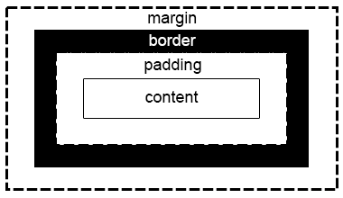

# Margin & Padding

- **Margin** : Outer Spacing
- **Padding** : Inner Spacing



## CSS Properties

### Padding
| Properties       | Value                                  |
| ---------------- | -------------------------------------- |
| `padding`        | `px`, `cm`, `mm`, `in`, `pt` . . . etc |
| `padding-left`   | `px`, `cm`, `mm`, `in`, `pt` . . . etc |
| `padding-right`  | `px`, `cm`, `mm`, `in`, `pt` . . . etc |
| `padding-top`    | `px`, `cm`, `mm`, `in`, `pt` . . . etc |
| `padding-bottom` | `px`, `cm`, `mm`, `in`, `pt` . . . etc |

### Margin
| Properties      | Value                                  |
| --------------- | -------------------------------------- |
| `margin`        | `px`, `cm`, `mm`, `in`, `pt` . . . etc |
| `margin-left`   | `px`, `cm`, `mm`, `in`, `pt` . . . etc |
| `margin-right`  | `px`, `cm`, `mm`, `in`, `pt` . . . etc |
| `margin-top`    | `px`, `cm`, `mm`, `in`, `pt` . . . etc |
| `margin-bottom` | `px`, `cm`, `mm`, `in`, `pt` . . . etc |

### Example

Padding :
```css
.mybox-1 {
    padding: 20px;
}

.mybox-2 {
    padding: 20px 30px;
}

.mybox-3 {
    padding: 20px 30px 40px 50px;
}

.mybox-2 {
    padding-top: 20px;
    padding-right: 30px;
    padding-bottom: 40px;
    padding-left: 50px;
}
```

Margin: 
```css
.mybox-1 {
    margin: 20px;
}

.mybox-2 {
    margin: 20px 30px;
}

.mybox-3 {
    margin: 20px 30px 40px 50px;
}

.mybox-2 {
    margin-top: 20px;
    margin-right: 30px;
    margin-bottom: 40px;
    margin-left: 50px;
}
```