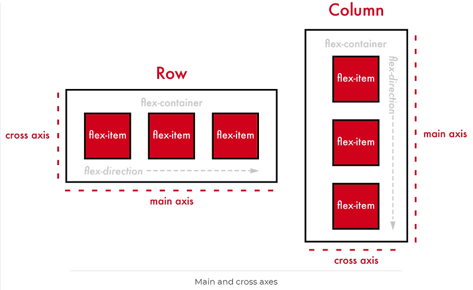
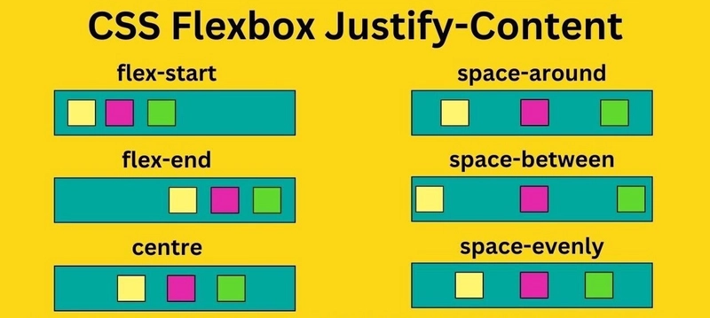
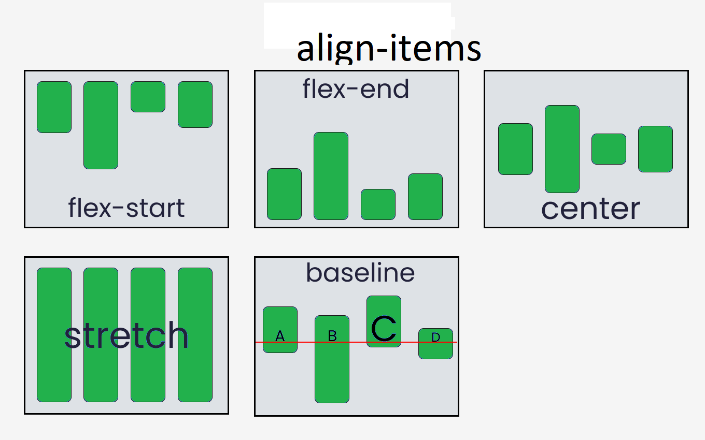

# CSS - Flex


- Horizontal Alignment
- Vertical Alignment

## CSS - Properties

| Properties        | Values                                                                    |
| ----------------- | ------------------------------------------------------------------------- |
| `display`         | `block`, `flex`, `grid`, `none`, `inline`, . . . etc                      |
| `flex-direction`  | `row`, `row-reverse`, `column`, `column-reverse`                          |
| `justify-content` | `start`, `center`, `end`, `space-between`, `space-around`, `space-evenly` |
| `align-items`     | `start`, `center`, `end`, `stretch`                                       |
| `gap`             | `px`, `cm`, `mm`, `in` . . . etc                                          |

## Flex Direction 


## Justify Content (Main Axis)


## Align Items (Cross Axis)



### Example :

#### Parent

```css
.parent-container {
  display: flex;
  flex-direction: row;
  /* Main axis direction 
        - row
        - row-reverse
        - column
        - column-reverse)
    */
  flex-wrap: wrap;
  /* Allows wrapping 
        - nowrap
        - wrap
        - wrap-reverse
    */
  justify-content: space-between; 
  /* Main-Axis alignment of Items
        - start
        - center
        - end
        - space-between
        - space-around
        - space-evenly
    */
  align-items: center;
  /* Cross-Axis Alignment of items 
        - start
        - center
        - end
        - stretch
        - ...
    */
  align-content: stretch; 
  gap: 10px;
  row-gap: 15px;
  column-gap: 20px;
}
```
#### Child

```css
.child-item {
  flex: 1 1 auto;      /* flex-grow, flex-shrink, flex-basis shorthand */
  order: 0;            /* Defines the order of the item */
  align-self: auto;    /* Overrides align-items for individual item */
}
```