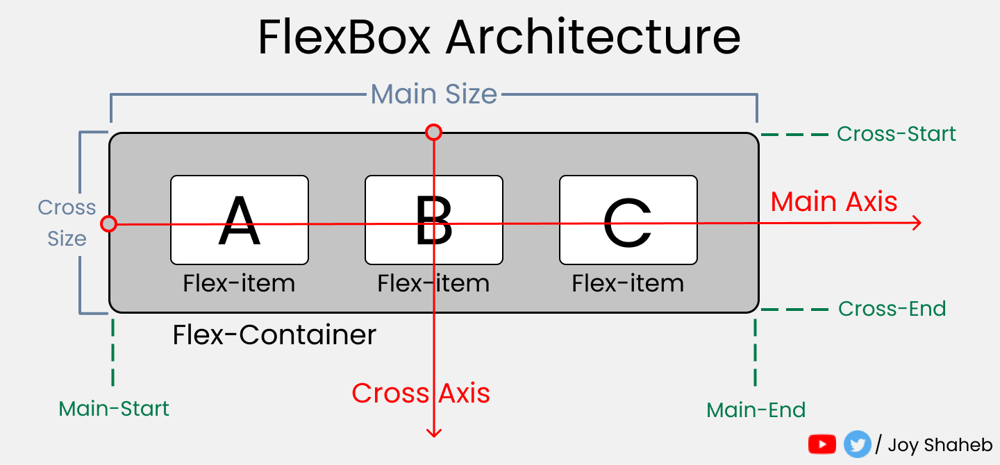

# CSS - Flex

- Horizontal Alignment
- Vertical Alignment

## CSS - Properties

| Properties        | Values                                                                    |
| ----------------- | ------------------------------------------------------------------------- |
| `display`         | `block`, `flex`, `grid`, `none`, `inline`, . . . etc                      |
| `flex-direction`  | `row`, `row-reverse`, `column`, `column-reverse`                          |
| `justify-content` | `start`, `center`, `end`, `space-between`, `space-around`, `space-evenly` |
| `align-items`     | `start`, `center`, `end`, `stretch`                                       |
| `gap`             | `px`, `cm`, `mm`, `in` . . . etc                                          |

## Flex Direction 

## Justify 

# ALign Items
