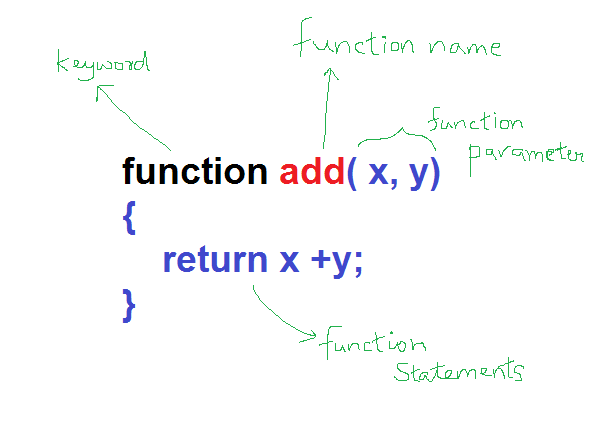
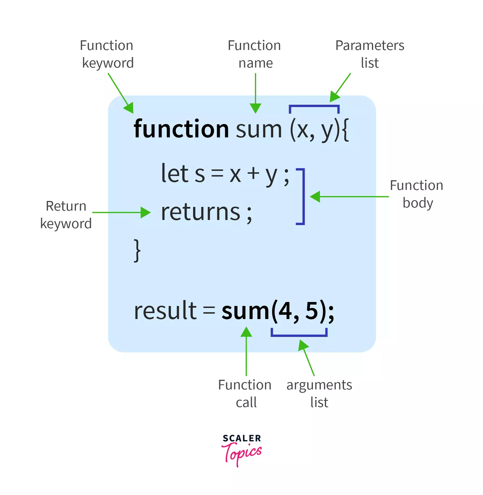
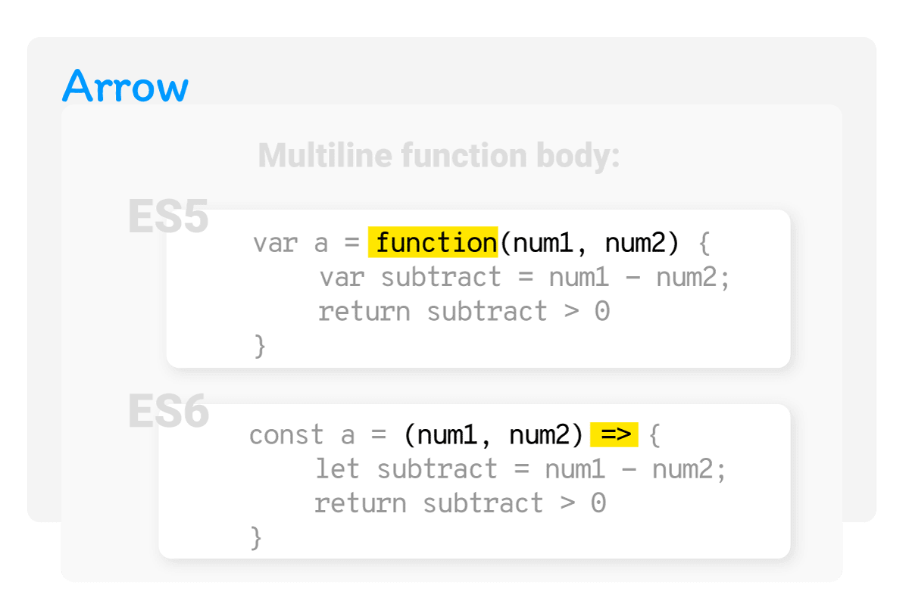
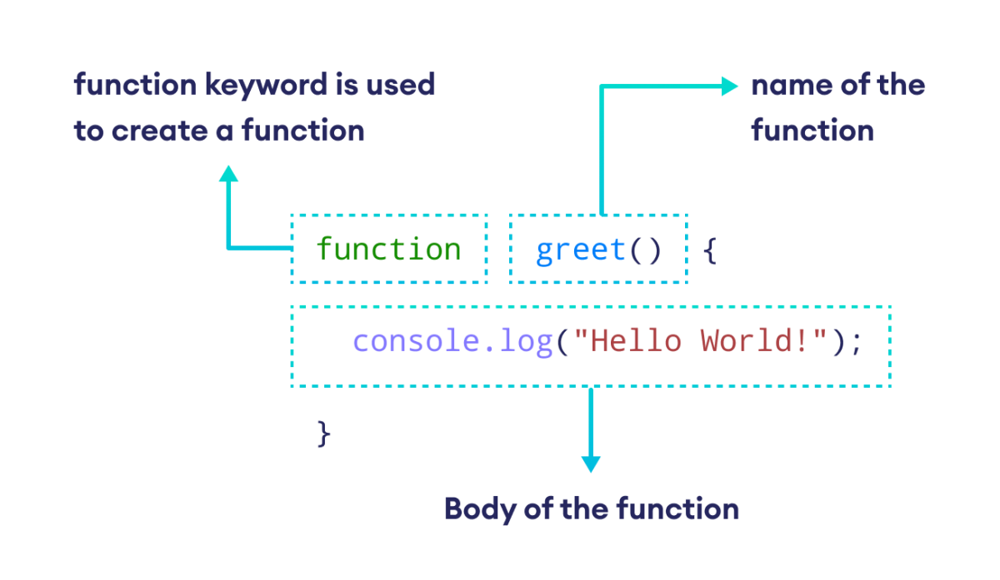

# Javascript Functions







### 1. **Function Declaration**

* Declares a reusable block of code using the `function` keyword.

```javascript
function greet(name) {
  return `Hello, ${name}!`;
}
console.log(greet("Alice")); // Hello, Alice!
```

---

### 2. **Function Expression**

* A function assigned to a variable. Can be anonymous.

```javascript
const greet = function(name) {
  return `Hello, ${name}!`;
};
console.log(greet("Bob")); // Hello, Bob!
```

---

### 3. **Arrow Functions**

* A concise way to write functions using `=>`. Lexically binds `this`.

```javascript
const greet = (name) => `Hello, ${name}!`;
console.log(greet("Charlie")); // Hello, Charlie!
```

---

### 4. **Immediately Invoked Function Expression (IIFE)**

* A function that runs immediately after it's defined. Useful for isolating scope.

```javascript
(function() {
  console.log("IIFE runs immediately!");
})(); // IIFE runs immediately!
```

---

### 5. **Default Parameters**

* Allows parameters to have default values if not provided.

```javascript
function greet(name = "Guest") {
  return `Hello, ${name}!`;
}
console.log(greet()); // Hello, Guest!
```

---

### 6. **Rest Parameters**

* Gathers multiple arguments into a single array-like parameter.

```javascript
function sum(...numbers) {
  return numbers.reduce((a, b) => a + b, 0);
}
console.log(sum(1, 2, 3)); // 6
```

---

### 7. **Callback Functions**

* A function passed into another function as an argument.

```javascript
function greet(name, callback) {
  console.log(`Hello, ${name}!`);
  callback();
}

function afterGreet() {
  console.log("Nice to meet you!");
}

greet("Dave", afterGreet);
```

---

### 8. **Higher-Order Functions**

* Functions that take other functions as arguments or return them.

```javascript
function multiplier(factor) {
  return function(x) {
    return x * factor;
  };
}

const double = multiplier(2);
console.log(double(5)); // 10
```

---

### 9. **Closures**

* A function that remembers its outer variables even after the outer function has finished executing.

```javascript
function counter() {
  let count = 0;
  return function() {
    count++;
    return count;
  };
}

const increment = counter();
console.log(increment()); // 1
console.log(increment()); // 2
```

---

### 10. **Function Constructor**

* Creates a new function dynamically (not commonly used).

```javascript
const sum = new Function('a', 'b', 'return a + b');
console.log(sum(2, 3)); // 5
```

---

### 11. **Recursive Functions**

* A function that calls itself to solve a problem.

```javascript
function factorial(n) {
  if (n <= 1) return 1;
  return n * factorial(n - 1);
}
console.log(factorial(5)); // 120
```

---

### 12. **Async Functions**

* Declared with `async`, used with `await` for asynchronous operations.

```javascript
async function fetchData() {
  const response = await fetch("https://api.example.com/data");
  const data = await response.json();
  console.log(data);
}
```

---

### 13. **Generator Functions**

* Use `function*` syntax and `yield` to return multiple values lazily.

```javascript
function* numbers() {
  yield 1;
  yield 2;
  yield 3;
}

const gen = numbers();
console.log(gen.next().value); // 1
```

