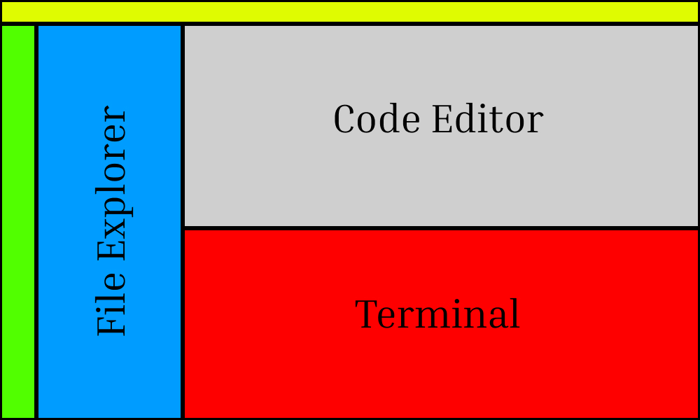

# Main VS-Code Components

1. File Explorer
2. Main Code Editor
3. Terminal

# VS-Code Shortcuts

| Shortcuts               | Explanation                           |
| ----------------------- | ------------------------------------- |
| `ctrl + k` & `ctrl + o` | To Open a Folder in VS-Code           |
| `ctrl + ~`              | To open and close terminal in VS-Code |
| `ctrl + b`              | To open and close file explorer       |
| `ctrl + s`              | To save a file                        |

